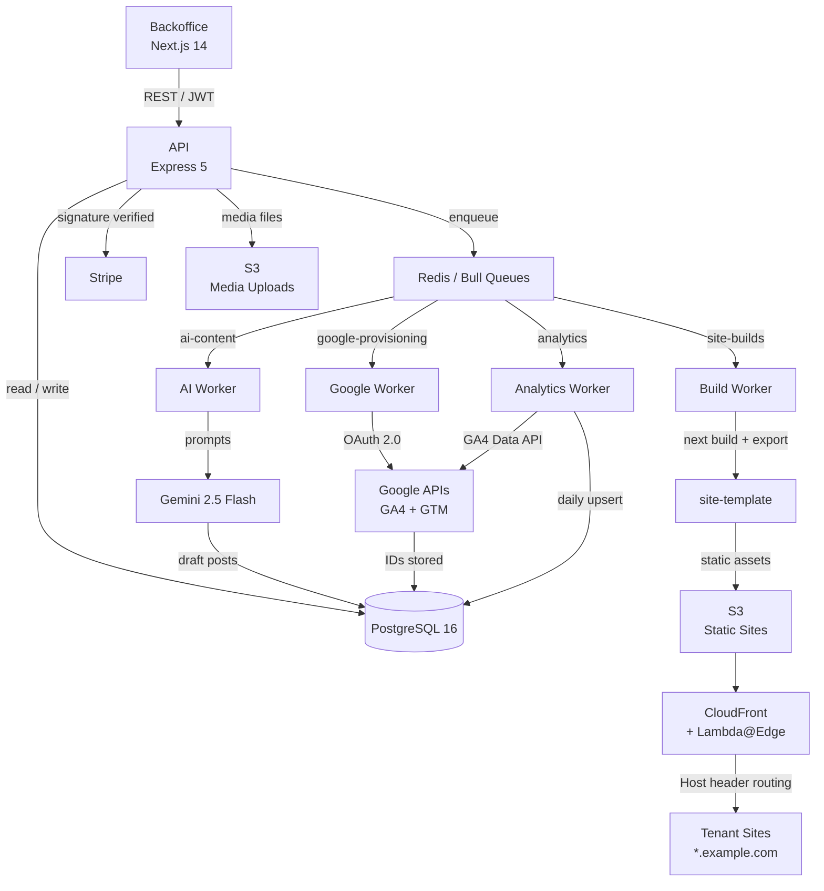

# AI-Assisted Content Pipeline

A multi-tenant blog platform with async static site generation, automated Google Analytics/Tag Manager provisioning, and AI-driven content workflows backed by human review.

---

---

## Overview

This platform lets users create and manage independent blog sites through a backoffice dashboard. Each site is served as fully static HTML, built on demand whenever content changes and distributed via CDN — no application server is exposed to end users at request time.

Core design goals:

- **Multi-site static generation** — each tenant's site is independently compiled and deployed to S3 + CloudFront, with Lambda@Edge handling subdomain routing across a single distribution
- **Async processing** — every heavy operation (static builds, AI content generation, analytics sync, Google provisioning) runs in background workers via queues, keeping the API response times flat regardless of downstream load
- **AI-assisted content workflows** — a two-phase pipeline (research → write) generates draft content using Gemini, gated by human review before any publication
- **Operational automation** — Google Analytics 4 and Google Tag Manager are provisioned automatically via OAuth after a one-time user authorization; no manual ID entry required

---

## Core Architecture

The system is organized as a monorepo with four primary applications and a shared infrastructure layer.

| App | Purpose | Tech |
|---|---|---|
| `api` | REST API, auth, queue producers, business logic | Node.js 20 + Express 5 |
| `backoffice` | Authenticated management dashboard | Next.js 14 (App Router) |
| `site-template` | Per-tenant static site build target | Next.js 14 (static export) |
| `lambda-edge` | CDN-level subdomain routing | AWS Lambda@Edge |

Background workers run as separate processes within the API container boundary:

| Worker | Responsibility |
|---|---|
| `buildWorker` | Static site generation and S3 deployment |
| `aiWorker` | Content research and draft post generation via Gemini |
| `googleWorker` | GA4 property and GTM container provisioning |
| `analyticsWorker` | Custom event persistence and GA4 metrics daily sync |

Separation of concerns is enforced at the process boundary: the API never performs blocking work inline. Builds, AI generation, provisioning, and analytics are always delegated to workers, decoupling request latency from downstream execution time.

---

## Event-Driven Workflow

Content changes propagate through the system asynchronously:

1. **Content updated** — author publishes or edits a post in the backoffice
2. **Build job enqueued** — the API writes a `{ siteId, trigger }` job to the `site-builds` queue and returns immediately
3. **Worker executes** — the build worker fetches current site data from PostgreSQL, writes JSON snapshots to an isolated temp directory, and runs `next build` against the site-template
4. **Artifacts uploaded** — static output is synced to S3 under the tenant's slug prefix; existing objects are deleted before upload for a clean deploy
5. **Cache invalidated** — a CloudFront invalidation request surfaces the new content within seconds

The same queue-first pattern applies to all long-running operations:

- **AI generation** is triggered by submitting a content strategy brief; research and writing phases run entirely in the background across sequential jobs
- **Google provisioning** runs once after OAuth authorization; the backoffice polls a status endpoint until the worker reports completion
- **Analytics sync** runs on a daily cron schedule (default: 3 AM UTC), pulling GA4 metrics and upserting post- and site-level performance data

Decoupling these workflows from the request path means failures are isolated, retried with exponential backoff (3 attempts, 5-second initial delay), and do not affect API availability.

---

## Technical Highlights

**Queue architecture**
Bull (Redis-backed) with four named queues and configurable concurrency per worker. Job history is retained for observability without unbounded growth — successful jobs capped at 100, failed jobs at 50.

**Atomic static deploys**
Each build runs in an isolated directory (`/tmp/builds/{siteId}/`). S3 upload deletes all existing objects under the tenant prefix before writing new ones, preventing stale file accumulation. CloudFront is invalidated post-upload.

**Monorepo with independent process boundaries**
All apps live under `apps/` but run as independent processes or containers. Workers are horizontally scalable: increasing `BUILD_CONCURRENCY` or `AI_JOB_CONCURRENCY` requires no architectural changes.

**Two-phase AI content pipeline**
Gemini 2.5 Flash drives a researcher agent (topic roadmap as structured JSON) followed by a writer agent (full HTML draft per topic). Both phases produce typed outputs validated before persistence. No AI-generated content enters the system with `status: published`.

**Automated Google provisioning**
After a one-time OAuth consent, the platform creates a GA4 property, data stream, and GTM container — publishes the container and stores all generated IDs. OAuth tokens are encrypted at rest (AES-256-GCM) and refreshed proactively 5 minutes before expiry.

**Multi-tenant CDN routing**
A single CloudFront distribution serves all tenants. Lambda@Edge reads the `Host` header at the viewer-request stage and rewrites the S3 origin path to the correct slug prefix — no per-tenant distribution management required.

**Security primitives**
- JWT access tokens (15-minute TTL) + rotating refresh tokens in `httpOnly` cookies
- CSRF protection on Google OAuth via Redis-backed single-use nonces inside signed JWT state parameters
- Stripe webhook signature verification on every inbound event
- All database queries scoped by `user_id` or validated through the ownership middleware before execution

**Quality gates (CI pipeline)**
- ESLint validation
- Jest integration test suite (Supertest against real database)
- TypeScript type checking (backoffice)
- Next.js build validation (backoffice + site-template)
- Pull request checks required before merge to main

---

## Engineering Focus

This repository is a platform engineering project designed around maintainability, operational simplicity, and async-first architecture — not as a minimal proof of concept.

Key design principles:

- **Async by default** — no synchronous side effects in the request path; all external operations are enqueued and return immediately to the caller
- **Operational simplicity** — Docker Compose covers the full local stack; production adds S3 and CloudFront but introduces no new architectural primitives
- **Predictable failure modes** — queue retries with backoff, isolated build directories, and atomic S3 deploys prevent partial or corrupt state
- **Maintainability** — database schema is managed through sequential migration files; no ORM magic for schema changes
- **Developer experience** — a single `docker compose up` gets PostgreSQL and Redis running; each app starts independently with `npm run dev`

---

## AI-Assisted Engineering

AI is used in two distinct ways: as a content generation engine for platform users, and as a productivity tool during development.

See [AI-PHILOSOPHY.md](AI-PHILOSOPHY.md) for a full breakdown of the prompt design, validation strategy, and human-in-the-loop safeguards.

**Content generation summary**

The AI pipeline accepts a content strategy brief — company context, target audience, pain points, differentiators — and runs it through two sequential prompt stages:

1. **Research phase** — produces a JSON roadmap of 15 prioritized topics with editorial angles, target keywords, content formats, and outline headings
2. **Writing phase** — generates a full HTML draft per topic, including title, slug, excerpt, SEO metadata, and reading time

Outputs are saved as `draft` posts and surfaced in the backoffice for review. No AI-generated content is published without explicit human action — the publish step is always a deliberate, manual operation.

---

## Testing Strategy

See [TESTING-PHILOSOPHY.md](TESTING-PHILOSOPHY.md) for a full description.

The test suite is integration-focused: tests run against a real in-memory database with Supertest exercising the full request/response cycle. External dependencies (Stripe, queues) are mocked at the module boundary.

Coverage goals are secondary to workflow reliability. Priority areas:

- Authentication and token lifecycle
- Payment and subscription activation via Stripe webhooks
- Ownership enforcement across all resource operations
- Post publication and build queue enqueue behavior

---

## Setup

See [SETUP.md](SETUP.md) for prerequisites, environment variables, database setup, and service integrations.

---

## Future Improvements

See [TODO.md](TODO.md) for the current roadmap, grouped by initiative.

---

